

<h2>✋ GGI: Gesture Grip Interface - VR Hand Tracking Tool Selection</h2>

  <h3>
    
    GGI Demo
  </h3>

  <a href="https://youtu.be/Ah9duF-CNkg?si=ZlmGNsm-4PTqdtqU" target="_blank">
    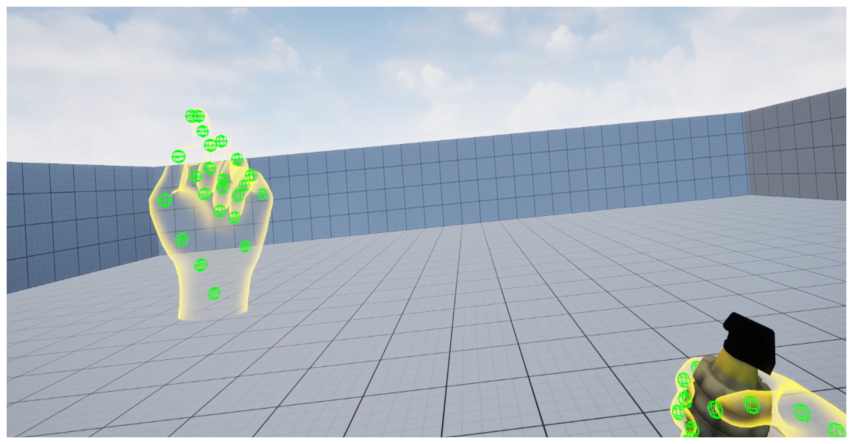
  </a>

  
<i>이미지를 클릭하시면 유튜브 데모 영상으로 이동합니다.</i>

   
  VR 핸드 트래킹 환경에서 사용자의 그립 형태와 손 제스처를 함께 인식해, 
  의도한 도구를 자동으로 선택하는 인터페이스(GGI)를 연구·개발한 개인 프로젝트입니다. 
  손잡이 형태만으로는 구분이 어려운 도구를 제스처 정보로 보완했고, LSTM 모델로 7가지 상태(Idle 포함)를 분류했습니다. 

<!-- 기술스택 -->

  

 

  <b>Team Size</b> : 개인 프로젝트 &nbsp;|&nbsp; <b>Dev Period</b> : 2025.01 ~ 2025.04

 
 

## 🔍 연구 배경

#### 🚨 문제 상황 - 기존 VR 핸드 트래킹의 도구 선택 문제
* 특정 동작으로 도구 목록을 띄우고, 손으로 가리켜 선택하는 방식이 주로 사용됩니다.
* 선택 단계가 많아 시간이 걸리고, 도구가 밀집된 레이아웃에서는 정확도가 떨어질 수 있습니다.
* 빠른 반응이 중요한 시뮬레이션이나 게임 환경에서는 <b>이 과정이 몰입을 방해</b>합니다.

  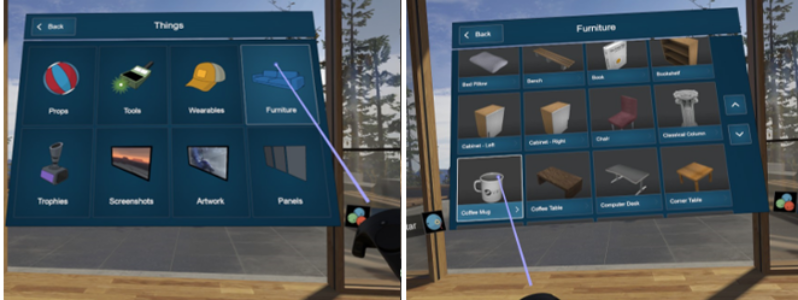
  
<i>기존 VR Hand Tracking 환경에서의 오브젝트 선택의 번거로움</i>

 

#### 📄 관련 논문 - VirtualGrasp (CHI 2018)
* VirtualGrasp에서는 <b>손잡이 모양을 묘사하면, 그와 유사한 손잡이를 가진 도구를 선택하는 상호작용</b>을 제안했습니다.

  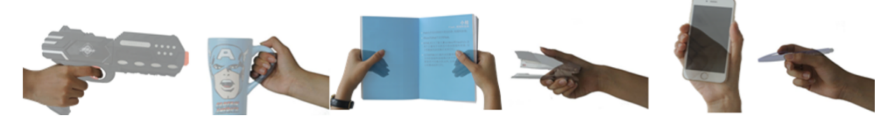
  
<i>참조 논문 : VirtualGrasp: Leveraging Experience of Interacting with Physical Objects to Facilitate Digital Object Retrieval</i>

 

#### 🚨 문제 상황 - VirtualGrasp의 한계
* <b>같은 손잡이 자세를 취해도 용도가 다른 도구가 검색</b>될 수 있습니다.
* 예: 골프채와 빗자루, 망치와 핸드 마이크, 총과 분무기

  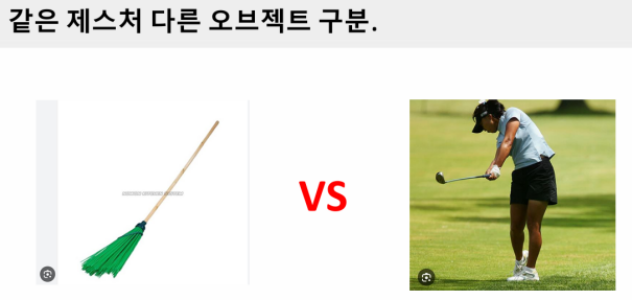
  
<i>같은 손잡이 자세, 다른 오브젝트</i>

 

#### 💡 고안한 방안 - 정적인 손 그립 모양에 제스처 데이터 추가
* 그립 형태에 손 제스처 정보를 더하면, <b>의도한 도구를 더 정확하게 구분</b>할 수 있다고 보았습니다.
* 제스처를 구분하려면 여러 프레임에 걸친 시계열 데이터를 분석해야 했습니다.
* 시퀀스의 앞뒤 정보를 안정적으로 학습하기 위해, <b>기울기 소실 문제를 보완한 LSTM</b>을 사용했습니다.

  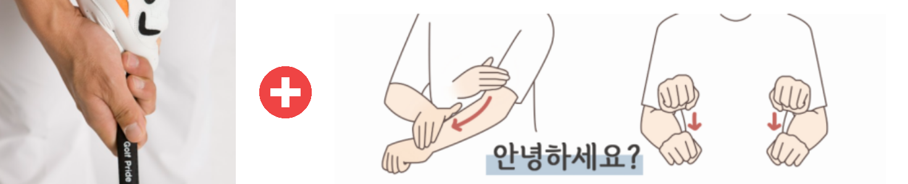
  
<i>그립 형태 + 손 제스처</i>

  

---

## 🚀 구현 내용

#### 🛠️ 구현 - LSTM 모델 구현 환경
* Unreal Engine 5와 MetaXR 플러그인으로 VR 핸드 트래킹을 구현하고, <b>손 위치와 관절 회전값을 직접 추출</b>했습니다.
* 수집한 데이터는 Python, TensorFlow 환경에서 학습했습니다.

#### 📐 입력 데이터 (카메라 좌표계 기준)
* 왼손과 오른손의 상대 위치 벡터 (x, y, z)
* 양손 각각의 속도 (x, y, z)
* 양손 각각의 손목 회전값 (Pitch, Yaw, Roll)
* 손목을 제외한 17개 손가락 관절의 상대 회전값 (Pitch, Yaw, Roll)

#### 🏷️ 시연을 위한 도구 레이블 분류
* 6가지 도구와 Idle 상태를 더해 총 7가지 상태로 분류했습니다.
* Idle, Bow, Pistol, Machine Gun, Sword, Spear, Grenade

 

#### 🛠️ 구현 - LSTM 데이터 수집 및 학습
* 도구별 사용 제스처와 손잡이 모양을 직접 취하며 <b>40프레임 동안 녹화</b>했습니다.
* 레이블당 200회씩 반복해, <b>7개 레이블에서 총 56,000프레임을 수집</b>했습니다.

  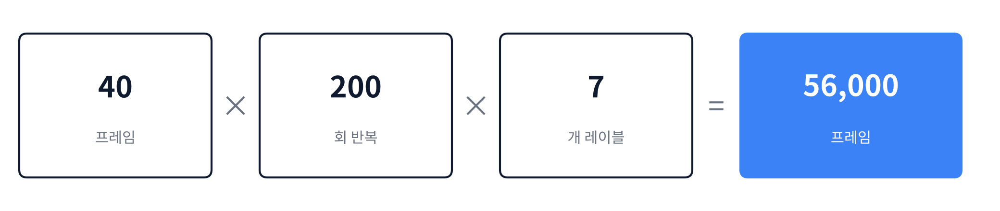

 

#### ⚙️ 학습 설정
* LSTM Window Size : 40 (수집 단위인 40프레임과 맞춤)
* Train : Validation = 80 : 20

  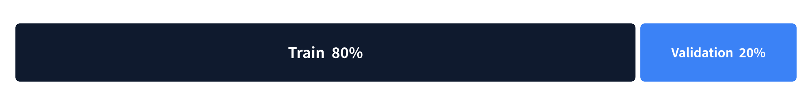
    
  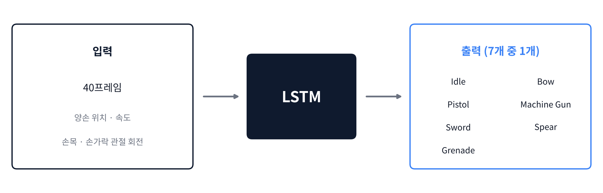

  

---

## 🔧 트러블 슈팅 - 입력 데이터 구성

* 제스처 인식이 제대로 되지 않는 원인을 찾아, <b>입력 데이터 구성을 세 단계에 걸쳐 바꾸었습니다.</b>

#### 🚨 1차 - 손목의 위치값으로 제스처 판단
* 초기에는 손의 움직임을 카메라 좌표계 기준 <b>위치값</b>으로 학습했습니다.
* 이 방식은 손의 움직임이 특정 위치에 종속되어, <b>조금만 다른 위치에서 같은 제스처를 수행해도 인식되지 않는 문제</b>가 있었습니다.

  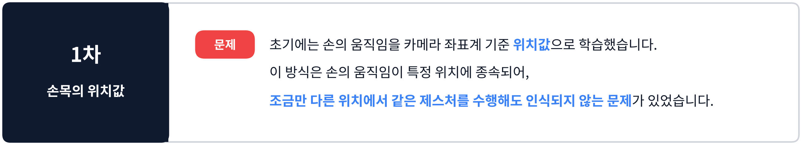

 

#### 💡 2차 - 손목의 속도값으로 제스처 판단
* 위치 종속 문제를 해결하기 위해, 손목의 위치값 대신 <b>속도값</b>을 사용했습니다.
* 그 결과 <b>위치에 관계없이 제스처 움직임을 인식할 수 있었습니다.</b>

#### 🚨 2차에서 발생한 문제
* 양손의 속도값만으로는 양손의 상대 위치 정보를 알 수 없어, 왼손과 오른손을 각각 독립된 움직임으로만 인식했습니다.
* 이로 인해 <b>왼손과 오른손의 관계성을 고려하지 못하는 문제</b>가 있었습니다.
* 예를 들어, 왼손이 오른손보다 위에 있는지 아래에 있는지에 대한 정보가 없었습니다.

  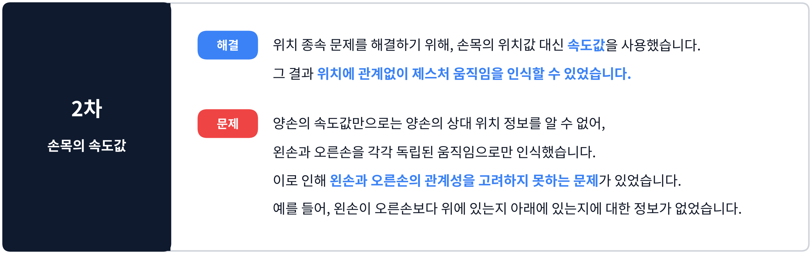

 

#### 💡 3차 - 손목의 속도값 + 양손의 상대 위치 데이터로 제스처 판단
* 양손이 각각 독립된 움직임으로 인식되는 문제를 해결하기 위해, 왼손과 오른손의 <b>상대 위치 데이터</b>를 추가했습니다.
* 그 결과 양손의 상대 위치를 추적할 수 있어, <b>양손의 관계성을 고려한 제스처 인식</b>이 가능해졌습니다.

  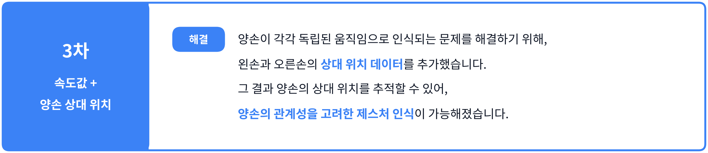

  

---

## 🎯 결과

  <h3>
    
    결과(1) - Bow, Pistol, Machine Gun
  </h3>

  <a href="https://youtu.be/Ah9duF-CNkg?si=ZlmGNsm-4PTqdtqU" target="_blank">
    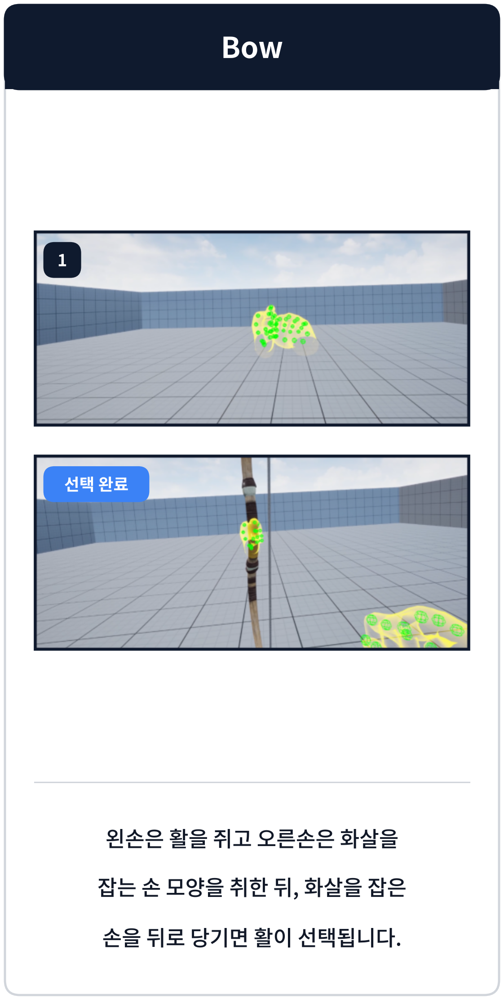
    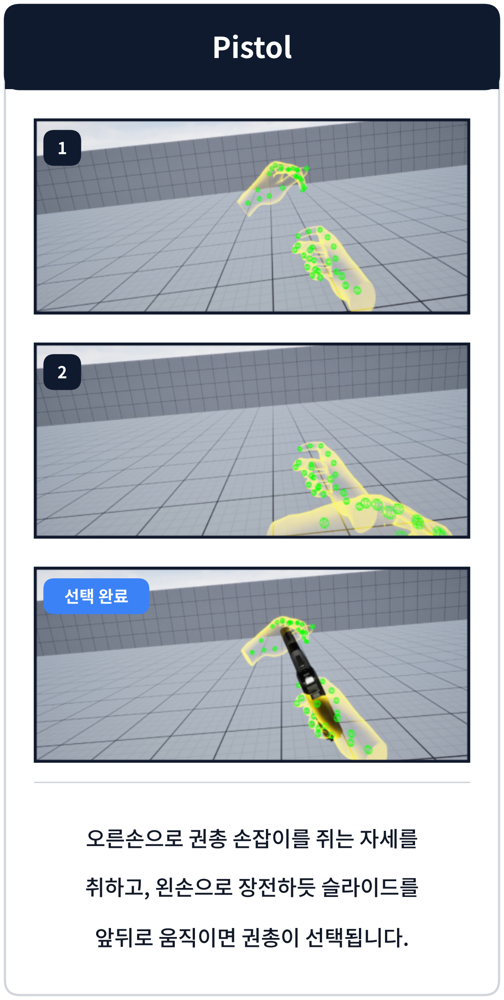
    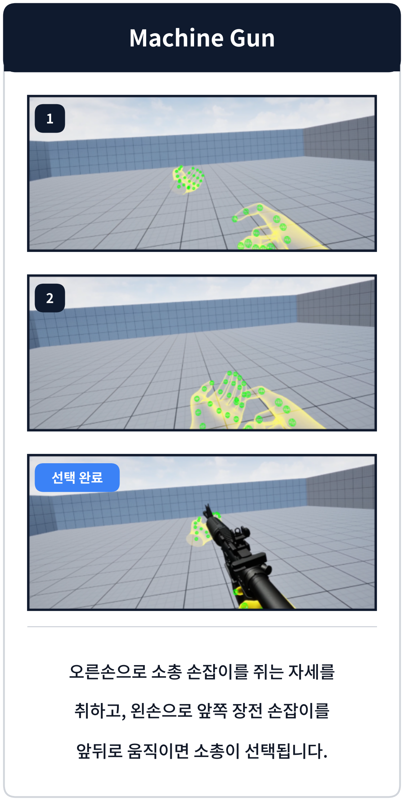
  </a>

  
<i>이미지를 클릭하시면 유튜브 데모 영상으로 이동합니다.</i>

* <b>Bow</b> : 왼손은 활을 쥐고 오른손은 화살을 잡는 손 모양을 취한 뒤, 화살을 잡은 손을 뒤로 당기면 활이 선택됩니다.
* <b>Pistol</b> : 오른손으로 권총 손잡이를 쥐는 자세를 취하고, 왼손으로 장전하듯 슬라이드를 앞뒤로 움직이면 권총이 선택됩니다.
* <b>Machine Gun</b> : 오른손으로 소총 손잡이를 쥐는 자세를 취하고, 왼손으로 앞쪽 장전 손잡이를 앞뒤로 움직이면 소총이 선택됩니다.

 

  <h3>
    
    결과(2) - Sword, Spear, Grenade
  </h3>

  <a href="https://youtu.be/Ah9duF-CNkg?si=ZlmGNsm-4PTqdtqU" target="_blank">
    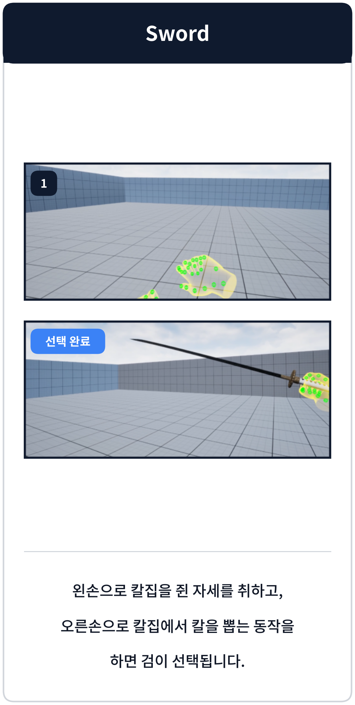
    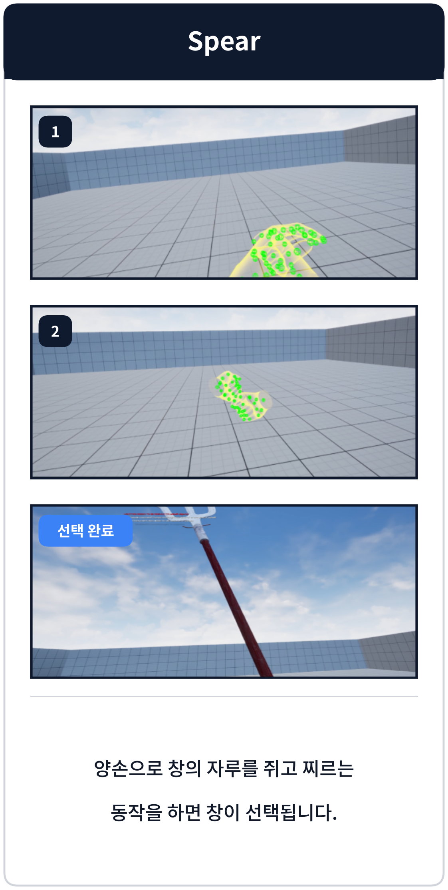
    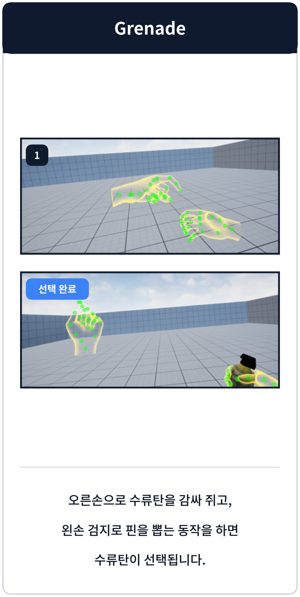
  </a>

  
<i>이미지를 클릭하시면 유튜브 데모 영상으로 이동합니다.</i>

* <b>Sword</b> : 왼손으로 칼집을 쥔 자세를 취하고, 오른손으로 칼집에서 칼을 뽑는 동작을 하면 검이 선택됩니다.
* <b>Spear</b> : 양손으로 창의 자루를 쥐고 찌르는 동작을 하면 창이 선택됩니다.
* <b>Grenade</b> : 오른손으로 수류탄을 감싸 쥐고, 왼손 검지로 핀을 뽑는 동작을 하면 수류탄이 선택됩니다.

  

---

## 📝 아쉬운 점

#### 1. 불량 데이터

#### 🚨 문제
* 데이터를 직접 수집하는 과정에서 캡처 시작과 종료 시점이 명확하지 않았습니다.
* 이로 인해 <b>시작 타이밍이 명확하지 않은 데이터가 일부 포함</b>되었습니다.

#### 💡 개선 방향
* <b>모호한 데이터를 검출하고 정제하는 툴</b>을 만들어 정제된 데이터만 학습했다면, 더 높은 정확도를 기대할 수 있었을 것입니다.

 

#### 2. 손 가려짐 문제

#### 🚨 문제
* VR HMD 카메라로 손을 추적하는 과정에서, <b>한 손이 다른 손을 가리면 가려진 손의 움직임을 추적하지 못하는 문제</b>가 있었습니다.
* 따라서 정확한 사용을 위해서는 두 손을 모두 추적할 수 있는 카메라 시점에서 동작해야 했습니다.

#### 💡 개선 방향
* <b>여러 각도에서 촬영 가능한 카메라를 사용하거나, 다른 Hand Tracking 장비를 도입</b>할 필요가 있습니다.

  
